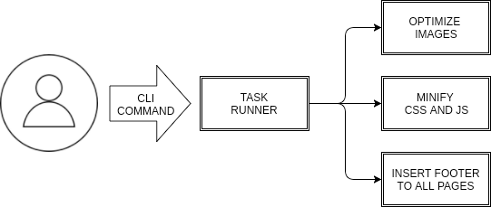
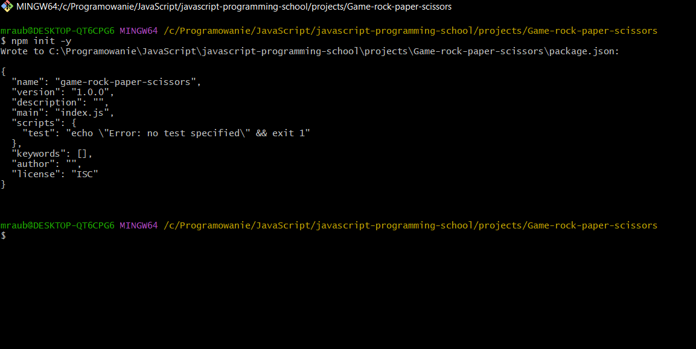
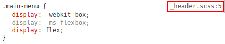

# Narzędzia ułatwiające pracę programisty a w szczególności programisty JavaScriptu

W tym rodziałe opisano narzędzia przydatne dla każdego programisty oraz te narzędzia, których na codzień używają programiści JavaScript:

Do pierwszej kategorii zaliczają się takie narzędzia jak:

- wiersz poleceń
- system kontroli wersji
- zintegrowane środowisko programistyczne

Do drugiej kategorii można zaliczyć takie narzędzia jak:

- ESLint do wyszukiwania błędów i niewłaściwego stylu kodu,
- Prettier do formatowania kodu,
- Jest do pisania testów jednostkowych,
- Npm do instalowania bibliotek,
- Webpack, parcel i gulp do scalania osobnych modułów w jeden duży moduł, gotowy do użycia w przeglądarce,
- Babel do tłumaczenia kodu wykorzystującego najnowsze funkcjonalności języka (lub jego rozszerzenia) na kod,
  który można uruchamiać w przeglądarce
- rozszerzenie JSX (stosowane w platformie React) umożliwiające kodowanie interfejsu użytkownika za pomocą wyrażeń
  JavaScriptu podobnych do znaczników HTML,
- rozszerzenie TypeScript umożliwiające sprawdzanie poprawności typów
  danych.
- [markdownlint](https://github.com/DavidAnson/markdownlint)
- [commonmark](https://commonmark.org/)
- [markdown](https://commonmark.org/help/)

## System kontroli wersji

### Instalacja programu Git

<!-- TODO -->
Oprogramowanie Git dla platform Windows, Linux oraz Mac znajdziesz [tutaj](http://git-scm.com/downloads). Uruchom plik `EXE`. Po zatwierdzeniu licencji, przejdziesz do wyboru komponentów. Zalecam skorzystanie z domyślnych opcji. Warto zostawić zaznaczoną opcję Windows Explorer integration (integracja z Eksploratorem Windows), dzięki której wystarczy kliknąć folder prawym przyciskiem myszy, aby móc uruchomić Gita w systemowym interfejsie graficznym lub wierszu poleceń z poziomu menu kontekstowego. Następnie przejdź wyboru domyślnego edytora, który wybierzesz z rozwijanej listy. W kolejnym okienku instalatora dostosujesz zmienną PATH. Trzecia opcja powoduje, że do ścieżek dostępu dodane zostaną ścieżki prowadzące do programu git oraz do narzędzi ssh, wc itd. Następnie wybieramy pierwszą opcję, aby nasze połączenia ze zdalnym repozytorium były szyfrowane.

Następny krok dotyczy znaków końca linii. Konfiguracja odbywa się na ekranie wyboru (rysunek 2.8). Różne systemy operacyjne obsługują pliki tekstowe na różny sposób, zwłaszcza w odniesieniu do znaków końca linii, przy czym zachodzi duże prawdopodobieństwo, że członkowie Twojego
zespołu korzystają z różnych systemów. Git musi zatem konwertować znaki zakończenia linii pomiędzy poszczególnymi konwencjami, kiedy przekazuje commity.

Ponieważ będziesz korzystać z systemu Windows, wybierz domyślną opcję. Pozostałe dwie mogą doprowadzić do poważnych uszkodzeń Twoich commitów, jeśli nie będziesz ostrożnie się obchodzić ze znakami końca linii.

Następne opcje pozostaw bez zmian.

### Konfiguracja Gita

<!-- Ponieważ Git jest rozproszonym system wersji, istnieje potrzeba łączenia się z innymi repozytoriami zdalnymi, toteż musimy określić swoją tożsamość. -->

Aby dowiedzieć się o wersji zainstalowanego oprogramwania w wierszu poleceń należy wpisać:

```bash
git --version
```

Wydając polecenie:

```bash
 git config -l
```

sprawdzisz, jakie obecnie obowiązują ustawienia. Wszystkie rewizje w repozytorium zawierają informację o autorze. Do ustalenia danych autora służą komendy:

```bash
git config --global user.name "Imie Nazwisko"
git config --global user.email you@example.com
```

W systemie Windows powyższe dane zapisywane są w pliku .gitconfig w folderze użytkownika, np. C:\Users\nazwakonta\.gitconfig. Plik ten powinien być zakodowany w UTF-8.

## Inspekcja kodu za pomocą narzędzia ESLint

Słowo lint (kłaczek) oznacza fragment kodu, który z technicznego punktu widzenia jest poprawny, ale nieestetyczny,
nieoptymalny i zawiera potencjalne błędy. **Linter** jest narzędziem wykrywającym tego rodzaju mankamenty, a
**lintowanie**oznacza czynność polegającą na wielokrotnym uruchamianiu lintera i poprawianiu błędów do momentu, aż
przestaną się pojawiać komunikaty ostrzegawcze.

Obecnie najpopularniejszym linterem dla języka JavaScript jest [ESLint](https://eslint.org).

`ESLint` statycznie analizuje Twój kod, aby szybko znaleźć problemy. Jest on wbudowany w większość edytorów tekstu. Możesz uruchomić go także z wiersza poleceń. Zainstalujesz go lokalnie w projekcie:

```bash
npm i -D eslint
```

Następnie należy skonfigurować plik konfiguracyjny, a najprostszym sposobem na to jest:

```bash
npm init @eslint/config
```

Następnie możesz uruchomić ESLint na dowolnym pliku lub katalogu w następujący sposób:

```bash
npx eslint yourfile.js
```

### Konfiguracja Eslint

Po uruchomieniu `npm init @eslint/config` będziesz miał w swoim katalogu plik `.eslintrc.{js,yml,json}`. W nim zobaczysz kilka reguł skonfigurowanych w ten sposób:

```json
{
    "rules": {
        "semi": ["error", "always"],
        "quotes": ["error", "double"]
    }
}
```

Nazwy "semi" i "quotes" to nazwy reguł w ESLint. Pierwsza wartość to poziom błędu reguły i może być jedną z następujących wartości:

- `"off"` lub `0` - wyłącz regułę
- `"warn"` lub `1` - włącz regułę jako ostrzeżenie (nie wpływa na kod wyjścia)
- `"error"` lub `2` - włącz regułę jako błąd (kod wyjścia będzie wynosił 1)

Trzy poziomy błędów umożliwiają precyzyjną kontrolę nad tym, jak `ESLint` stosuje reguły (więcej opcji konfiguracji i
szczegółów można znaleźć w [dokumentacji konfiguracyjnej](https://eslint.org/docs/user-guide/configuring/)).

Twój plik konfiguracyjny `.eslintrc.{js,yml,json}` będzie również zawierał linię:

```json
{
    "extends": "eslint:recommended"
}
```

Z powodu tego wiersza wszystkie reguły oznaczone „✓” na stronie reguł zostaną włączone. Alternatywnie możesz użyć
konfiguracji utworzonych przez innych, wyszukując „eslint-config” w `npmjs.com`. ESLint nie będzie lintować twojego
kodu, chyba że rozszerzysz go ze współdzielonej konfiguracji lub jawnie włączysz reguły w twojej konfiguracji.

## Następne kroki

- Dowiedz się o [zaawansowanej konfiguracji](https://eslint.org/docs/user-guide/configuring/) ESLint.
- Zapoznaj się z [opcjami wiersza poleceń](https://eslint.org/docs/user-guide/command-line-interface).
- Poznaj [integracje ESLint](https://eslint.org/docs/user-guide/integrations) z innymi narzędziami, takimi jak edytory,
  systemy kompilacji i nie tylko.
- Nie możesz znaleźć właściwej reguły? Stwórz własną niestandardową regułę.
- Uczyń ESLint jeszcze lepszym, przyczyniając się do tego.

### [Rozszerzenie VS Code ESLint](https://marketplace.visualstudio.com/items?itemName=dbaeumer.vscode-eslint)

Integruje ESLint z VS Code. Jeśli jesteś nowy w ESLint, sprawdź [dokumentację](https://eslint.org/).

Rozszerzenie korzysta z biblioteki `ESLint` zainstalowanej w otwartym folderze obszaru roboczego(*ang. opened workspace
folder*). Jeśli folder go nie zawiera, rozszerzenie szuka globalnej wersji instalacyjnej. Jeśli nie zainstalowałeś
ESLint ani lokalnie, ani globalnie, zrób to, uruchamiając `npm install eslint` w folderze obszaru roboczego w przypadku
instalacji lokalnej lub `npm install -g eslint` w przypadku instalacji globalnej.

## Formattowanie kodu za pomocą programu Prettier

Prettier wymusza spójny styl, analizując kod i ponownie drukując go z własnymi regułami, które uwzględniają maksymalną długość linii, zawijając kod w razie potrzeby.

### Konfiguracja Prettier'a w VSC

#### Domyślny formater

Aby upewnić się, że to rozszerzenie jest używane z innymi rozszerzeniami, które mogłeś zainstalować, pamiętaj, aby ustawić je jako domyślny program formatujący w ustawieniach VS Code. To ustawienie można ustawić dla wszystkich języków lub według określonego języka.

```json
{
  "editor.defaultFormatter": "esbenp.prettier-vscode",
  „[javascript]”: {
    "editor.defaultFormatter": "esbenp.prettier-vscode"
  }
}
```

Jeśli chcesz wyłączyć Prettier w określonym języku, możesz utworzyć plik .prettierignore lub użyć ustawień editor.defaultFormatter programu VS Code.

Poniższe będzie używać Prettier dla wszystkich języków z wyjątkiem JavaScript.

{
  "editor.defaultFormatter": "esbenp.prettier-vscode",
  „[javascript]”: {
    "editor.defaultFormatter": "<inny program formatujący>"
  }
}

Poniższe użyje Prettier tylko dla JavaScript.

{
  "editor.defaultFormatter": "<inny program formatujący>",
  „[javascript]”: {
    "editor.defaultFormatter": "esbenp.prettier-vscode"
  }
}

Dodatkowo możesz wyłączyć formatowanie podczas zapisywania dla określonych języków, jeśli nie chcesz, aby były one automatycznie formatowane.

{
  „[javascript]”: {
    "editor.formatOnSave": fałsz
  }
}

Ładniejsza rozdzielczość
To rozszerzenie będzie używać ładniejszych z lokalnych zależności Twojego projektu (zalecane). Gdy prettier.resolveGlobalModules ma wartość true, rozszerzenie może również próbować rozwiązać moduły globalne. Jeśli ładniejsza nie zostanie zainstalowana lokalnie z zależnościami projektu lub globalnie na komputerze, zostanie użyta wersja ładniejsza, która jest dołączona do rozszerzenia.

Aby zainstalować ładniejsze w swoim projekcie i przypiąć jego wersję zgodnie z zaleceniami, uruchom:

npm i -D -E prettier

UWAGA: Zostaniesz poproszony o potwierdzenie, że chcesz, aby rozszerzenie załadowało moduł Prettier. Ma to na celu upewnienie się, że nie ładujesz modułu lub skryptu, który nie jest zaufany.

Wtyczki
To rozszerzenie obsługuje wtyczki Prettier, gdy używasz lokalnie lub globalnie rozwiązanej wersji Prettier. Jeśli masz Prettier i wtyczkę zarejestrowaną w swoim package.json, to rozszerzenie spróbuje zarejestrować język i zapewnić automatyczne formatowanie kodu dla języków wbudowanych i wtyczek.

Konfiguracja
Istnieje wiele opcji konfigurowania Prettier za pomocą tego rozszerzenia. Możesz użyć ustawień programu VS Code, ładniejszych plików konfiguracyjnych lub pliku .editorconfig. Ustawienia programu VS Code mają być używane jako rezerwa i generalnie są przeznaczone tylko do użytku w plikach innych niż projekt. Zaleca się, aby zawsze dołączyć do projektu ładniejszy plik konfiguracyjny, określający wszystkie ustawienia projektu. Zapewni to, że bez względu na to, jak uruchomisz ładniej - z tego rozszerzenia, z CLI lub z innego IDE z ładniejszymi, zostaną zastosowane te same ustawienia.

Zalecanym podejściem jest używanie plików konfiguracji Prettier do ustawiania opcji formatowania. Opcje są przeszukiwane rekursywnie w dół od formatowanego pliku, więc jeśli chcesz zastosować ładniejsze ustawienia do całego projektu, po prostu ustaw konfigurację w katalogu głównym. Ustawienia można również skonfigurować za pomocą programu VS Code — jednak ustawienia te będą miały zastosowanie tylko podczas uruchamiania rozszerzenia, a nie podczas uruchamiania ładniejszego za pomocą wiersza poleceń.

Konfiguracja opcji domyślnych
Niektórzy użytkownicy mogą nie chcieć tworzyć nowej konfiguracji Prettier dla każdego projektu lub używać ustawień VS Code. Aby ustawić domyślną konfigurację, ustaw prettier.configPath. Należy jednak uważać, jeśli ta wartość jest ustawiona, ta wartość będzie zawsze używana, a lokalne pliki konfiguracyjne będą ignorowane.

Ustawienia kodu programu Visual Studio
Możesz użyć ustawień VS Code, aby skonfigurować ładniejsze. Ustawienia zostaną odczytane z (wymienione według priorytetu):

Ładniejszy plik konfiguracyjny
.editorconfig
Ustawienia kodu programu Visual Studio (ignorowane, jeśli obecna jest jakakolwiek inna konfiguracja)
UWAGA: Jeśli istnieje jakikolwiek lokalny plik konfiguracyjny (np. .prettierrc), ustawienia VS Code NIE będą używane.

Stosowanie
Korzystanie z palety poleceń (CMD/CTRL + Shift + P)

1. CMD + Shift + P -> Formatuj dokument
LUB
1. Wybierz tekst, który chcesz upiększyć
2. CMD + Shift + P -> Wybór formatu

Skróty klawiszowe
Visual Studio Code udostępnia domyślne skróty klawiaturowe do formatowania kodu. Możesz dowiedzieć się o nich dla każdej platformy w dokumentacji VS Code

## Zarządzanie pakietami za pomocą narzędzia npm

Obecnie w każdym projekcie wykorzystuje się zewwnętrzne biblioteki, które łatwo się wyszykuje i instaluje za pomocą menadżera pakietów takiego jak `npm`, czyli `Node Package Manager`. Rejestruje on w pliku *`package.json`*, umieszczonym w katalogu głównym projektu, zależności pomiędzy bibliotekami inne informacje o programie.

Na początku tworzymy katalog projektu i w wierszu poleceń (w konsoli) wydajemy  polecenie:

```bash
npm init -y
```

Zostanie automatycznie utworzony plik *`package.json`*.

Następnie poleceniem:

```bash
npm i -D/-S/ <name_package> 

# -D instaliją się zależności potrzebne na etapie developmentu projektu, np. narzędzia Prettier, Sass czy Eslint
# -S instalują się zależności potrzebne do działania projektu, np. taka
# biblioteka jak Express czy React. Tą flagę można pominąć jest ona domyślną.
```

instalujemy potrzebne w projekcie pakiety bibliotek.

Tak utworzony plik wraz z kodem programu możesz przekazać innemu programiście, który wpisze polecenie `npm install/i` i automatycznie pobierze i zainstaluje wszystkie biblioteki wymagane do uruchomienia Twojego programu w katalogu *`node_modules`*

Pakiety możemy odinstalować za pomocą polecenia:

```bash
npm uninstall <name_package>
```

Razem z menedżerem `npm` jest dostarczany program `npx`, dzięki któremu można uruchamiać lokalnie zainstalowane narzędzia.

### Task runner

Praca z task runnerem ma nie tylko wymiar edukacyjny, ale sprawdza się w pracy z mniejszzymi projektami. W pracy `web developera` często pojawiają się sytuacje, w których potrzebuje dostosować task runner do własnych potrzeb, dlatego umiejętność rozumienia działania prostego task runnera jest kluczowa. Webpack jest kombajnem, który świetnie nadaje się do pracy z dużymi projektami, dla małych jest przerośniętym rozwiązaniem. Webapack to coś więcej niż task runnera, gdyż oprócz wszystkich funkcji task runnera ma wiele innych dodadkowych funkcjonalności.

### Czym jest task runner?

Task runner służy do uruchamiania wielu narzędzi za pomocą jednej komendy. Co więcej, takich komend może być kilka i każda z nich będzie służyła do innego celu. Na przykład inny zestaw narzędzi będzie potrzebny do bieżącej pracy nad projektem niż do wygenerowania plików gotowych do publikacji na serwerze.



**Task runner** pozwoli na przyspieszenie i automatyzację czynności, które musimy często wykonywać. Nie będzie potrzeby pamiętania które narzędzia trzeba uruchomić w danym projekcie - zwykle będzie to się ograniczać do jednej z kilku komend, które będą takie same w większości projektów.

Istnieje wiele task runnerów, ale my wykorzystamy skrypty `NPMa` do stworzenia własnego, prostego `task runnera`. Takie rozwiązanie jest najprostsze w konfiguracji i pozwoli nam samodzielnie rozbudować zestaw narzędzi wykorzystywanych do pracy nad projektami.

Alternatywa dla task runnera są narzędzia: Gulp, Parcel czy Webpack.

### Instalacja Node.js

Przed rozpoczęciem instalacji sprawdź, czy masz obecnie zainstalowany Node.js. W tym celu w terminalu wykonaj komendy:

```bash
node -v
```

Następnie należy zaktualizować `npm`:

```bash
npm i -g npm@latest
```

### Utworzenie  w projekcie `Game-rock-paper-scissors` pliku package.json

Tworzymy na dysku lokalnym katalog *`Game-rock-paper-scissors`*, a w nim wwierszy poleceń wydajemy komendę:

```bash
npm init -y
```



### Dodajemy plik .gitignore

Tworzymy plik `.gitignore` a w nim wpisujemy:

```bash
# ide
.idea/
.vscode/

# build, dependencies
build/
dist/
node_modules/
package.lock.json
```

### Instalujemy pakiety

```bash
npm i -D browser-sync
npm i -D autoprefixer
npm i -D postcss postcss-cli
npm i -D html-validate
```

### Budujemy task runnera

Zainstalowaliśmy nowe narzędzia pomagające w pracy nad projektem i wiemy jak się nimi posługiwać. Nie ma jednak potrzeby, żeby tracić czas na uruchamianie każdego z nich z osobna. Dlatego zaautomatyzujemy uruchamianie naszych narzędzi - zbudujemy prosty `task runner` oparty o skrypty `NPM`. Skrypty czyli aliasy wykonujące zdefiniowane komendy.

W task runnarze definujemy następujące taski:

- build, który konwertuje pliki źródłowe na pliki gotowe do opublikowania na serwerze - np. może to być skonwertowanie plików .scss na .css, użycie Autoprefixera, minifikacja plików .js i/lub .css (zmniejszenie ich rozmiaru m.in. poprzez usunięcie spacji i enterów), etc.,
- watch, który działa w trakcie pracy nad projektem i na bieżąco wykonuje potrzebne operacje na plikach, np. konwertuje pliki .scss na .css po każdym zapisaniu pliku .scss,
- test, który sprawdza poprawność kodu, np. przeprowadzając walidację składni plików .html, .css i/lub .js.

Dzięki standaryzacji tych nazw tasków w każdym projekcie uruchamia się je w ten sam sposób, nawet jeśli uruchamiają one różne narzędzia.

Każdy task może uruchamiać również inne taski, więc np. `build` może uruchamiać task `test`, aby każde wygenerowanie wersji "produkcyjnej" wiązało się ze sprawdzeniem poprawności kodu.

Ponadto, często stosuje się mniejsze taski, dla zachowania przejrzystości. I tak np. walidacja plików .html może odbywać się w tasku o nazwie `test:html`, który będzie uruchamiany przez task `test`. W tym wypadku dwukropek jest po prostu częścią nazwy, która wygodnie rozdziela nam "kategorię" taska od jego konkretnego przeznaczenia.

### Struktura task runnera

Napiszemy trzy taski plus jeden dodatkowy, który przyszpieszy nam rozpoczęcie pracy z nowymi projektami:

- init-project
  - instalacja niezbędsnych pakietów.
  - stworzenie struktury katalogów
  - stworzenie pliku README.md i .gitignore
  - stworzenie pustych plików: src/index.html, src/sass/main.scss, src/js/app.js
- test
  - sprawdzanie poprawności html, sass i js
- build
  - konwersja plików .scss do .css
  - uruchomienie Autoprefixera
  - minifikacja pliku .css (usunięcie pustych lini w celu zmiejszenia rozmiaru pliku)
  - przetestowanie poprawności kodu
- watch
  - kompilowaniena na bieżąco plików .scss do .css
  - dodawanie prefikserów w plikach .css
  - odświwerzanie pzzeglądarki po każdej zmianie kodu

Każde zadanie w tasku będzie osobną komendą. Następnie task tylko wywoła te komendy w odpowiedniej kolejności.

Otwieramy w katalogu projektu w edytorze kodu plik package.json. W tym pliku będziemy pisać skrypty naszego task runnera. Plik ten powinien po wydaniu komendy w terminalu:

```bash
npm init -y 
```

wyglądać tak:

```json
{
  "name": "game-rock-paper-scissors",
  "version": "1.0.0",
  "description": "",
  "main": "index.js",
  "scripts": {
    "test": "echo \"Error: no test specified\" && exit 1"
  },
  "keywords": [],
  "author": "",
  "license": "ISC",
}
```

Skrypty będziemy pisali w sekcji `"scripts"`. Domyślnie został utworzony jeden task `test`. Uruchamia się go tak:

```bash
npm test
```

Jeszcze jeden task tak się uruchamia mianowicie task `start`:

```bash
npm start
```

Pozostałe taski takie jak `build` czy `watch` uruchamia się tak:

```bash
npm run build
npm run watch

# ogólnie tak:
npm run <name_task>
```

### **Task 1: inicjalizacja projektu**

Ten task będzie miał kilka subtasków:

- instalacja niezbędnych pakietów
- stworzenie struktury katalogów
- stworzenie pliku README.md i .gitignore
- storzenie pustych plików: .html, .scss i .js

#### Instalacja niezbędnych  pakietów

Kiedy dołączasz do istniejącego projektu, w którym jest plik `package.json`, nie musisz ponownie wywoływać komendy `npm init -y`. Podobnie będzie w sytuacji, gdy będziesz zakładać nowy projekt, kopiując z poprzedniego plik `package.json`, aby nie musieć przeprowadzać ponownej konfiguracji. W takim przypadku musisz zainstalować wszystkie pakiety, których lista znajduje się w pliku `package.json`. W tym celu wystarczy uruchomić komendę `npm install`.

W pliku `package.json` na taskiem `test` utwórz task `init-project` z komendą `npm install`:

```json
{
  "name": "game-rock-paper-scissors",
  "version": "1.0.0",
  "description": "",
  "main": "index.js",
  "scripts": {
    "init-project": "npm i",
    "test": "echo \"Error: no test specified\" && exit 1"
  },
  "keywords": [],
  "author": "frontend groupe",
  "license": "ISC",
 }

```

#### Stworzenie katalogów

Wykorzystamy pakiet `mkdirp`, bowiem chcemy aby ten task nie nadpisywał żadnych plików. Gdy przypakiem uruchomimy task w projekcie, który nie jest pusty, nie utracimy plików.

```bash
npm i -D mkdirp
```

Nad taskiem `test`, stwórz subtask `init:dirs`. Nazwy subtasków to słowo-klucz (w tym przypadku `init`), dwukropek i słowo wskazujące, za co odpowiada dany subtask. W subtasku wywołamy komendę: `"mkdirp dist src/sass src/css src/vendor src/images src/js"`.

```json
{
  "name": "game-rock-paper-scissors",
  "version": "1.0.0",
  "description": "",
  "main": "index.js",
  "scripts": {
    "init-project": "npm i",
    "init:dirs": "mkdirp dist src/sass src/css src/images src/js",
    "test": "echo \"Error: no test specified\" && exit 1"
  },
  "keywords": [],
  "author": "frontend groupe",
  "license": "ISC",
  "devDependencies": {
    "mkdirp": "^1.0.4"
  }
}
```

Na końcu każdej linii w pliku `package.json`, oprócz ostatniej, stawiamy przecinek.

#### Stworzenie plików

Nad taskiem `test` tworzymy kolejny subtask `init:files`.

```json
{
  "name": "game-rock-paper-scissors",
  "version": "1.0.0",
  "description": "",
  "main": "app.js",
  "scripts": {
    "init-project": "npm i",
    "init:dirs": "mkdirp dist src/sass src/css src/images src/js",
    "init:files": "touch README.md .gitignore src/index.html src/sass/main.scss src/js/app.js",
    "test": "echo \"Error: no test specified\" && exit 1"
  },
  "keywords": [],
  "author": "frontend groupe",
  "license": "ISC",
}
```

#### **Składamy subtaski w jednego taska**

Wszystkie subtaski będzie uruchamiał task `init-project`. Subtaski uruchamiamy sekwencyjnie. Możemy tu wykorzystać operator `&&`.

```json
{
  "name": "game-rock-paper-scissors",
  "version": "1.0.0",
  "description": "",
  "main": "app.js",
  "scripts": {
    "init-project": "npm i && npm run init:dirs && npm run init:files",
    "init:dirs": "mkdirp dist src/sass src/css src/images src/js",
    "init:files": "touch README.md .gitignore src/index.html src/sass/main.scss src/js/app.js",
    "test": "echo \"Error: no test specified\" && exit 1"
  },
  "keywords": [],
  "author": "frontend groupe",
  "license": "ISC",
}
```

#### **Optymalizacja taska**

Komenda taska jest długa można ją skrócić. Potrzebny jest do tego następny pakiet - `npm-run-all`.

```json
{
  "name": "game-rock-paper-scissors",
  "version": "1.0.0",
  "description": "Simple game as a demo of the task runner configuration",
  "main": "app.js",
  "scripts": {
    "init-project": "npm i && npm-run-all init:*",
    "init:dirs": "mkdirp dist src/sass src/images src/js",
    "init:files": "touch README.md .gitignore src/index.html src/sass/main.scss src/js/app.js",
    "test": "echo \"Error: no test specified\" && exit 1"
  },
  "keywords": [],
  "author": "",
  "license": "ISC",
  "devDependencies": {
    "browser-sync": "^2.27.10",
    "mkdirp": "^1.0.4",
    "npm-run-all": "^4.1.5"
  }
}
```

### **Task 2: testowanie plików (sprawdzanie poprawności kodu)**

Ważne jest, aby wszyscy developerzy pracujący nad projektem, stosowali te same zasady. Jeśli jeden z developerów skonfigurowałby sobie edytor tak, aby np. poprawiał "błędne" wcięcia (inne, niż używa zespól), to jego commity będą zawierać modyfikacje sporych części edytowanych plików. Wynika to z faktu, że dla Gita zmiana wcięcia np. z 4 na 2 spacje jest zmianą całej linii kodu. Będzie to prowadzić to konfliktów w repozytorium i długich godzin spędzonych na posprzątaniu tego bałaganu.

Do testowania plików będziemy potrzebowali następujących pakietów:

- `html-validate`
- `eslint`
- `stylelint`

#### **html-validate**

Walidator HTML5 offline. Weryfikuje pełny dokument lub mniejszy (niekompletny) szablon, np. ze składnika AngularJS lub Vue.js.

Instalujemy:

```bash
npm i -D html-validate
```

Użycie z wiersza poleceń:

```bash
html-validate [OPTIONS] [FILE|DIR|GLOB...]
```

Ponieważ globy są zwykle rozwijane przez twoją powłokę, pamiętaj, aby zacytować wzorzec, jeśli potrzebujesz składni node glob:

```bash
html-validate "src/**/*.html"
```

#### **Eslint**

To narzędzie służy do sprawdzania poprawności składni oraz formatowania kodu JS. W naszym task runnerze będzie automatycznie uruchamiane przy każdym wykonaniu komend: `npm run build, npm run watch, oraz npm run test`.
Pamiętaj, aby codziennie wyłączać npm run watch i włączać ponownie następnego dnia. Dzięki temu będziesz regularnie sprawdzać poprawność składni i formatowania.
W konfiguracji zawartej w pliku `.eslintrc.json`, który za chwilę stworzymy, znajdzie się tylko kilka podstawowych zasad:

- poprawne formatowanie, zgodne z tym ustawionym w EditorConfig (wcięcia, zakończenia linii),
- używamy pojedynczych cudzysłowów,
- stawiamy średniki na końcu każdej linii (poza wyjątkami).

#### **Utworzenie pliku kofiguracyjnego Eslinta**

Aby utworzyć plik konfiguracyjny eslinta należy wydać polecenie:

```bash
npm init @eslint/config
```

Po udzieleniu odpowiedzi na pytania konfiguratora zostanie automatycznie utworzony plik `.eslintrc.json`

```json
{
  "env": {
    "browser": true,
    "es2021": true,
    "node": true
  },
  "extends": [
    "eslint:recommended",
    "plugin:react/recommended"
  ],
  "parserOptions": {
    "ecmaFeatures": {
      "jsx": true
    },
    "ecmaVersion": "latest",
    "sourceType": "module"
  },
  "plugins": [
    "react"
  ],
  "rules": {
    "indent": [
      "error",
      2
    ],
    "linebreak-style": [
      "error",
      "unix"
    ],
    "quotes": [
      "error",
      "single",
      {
        "allowTemplateLiterals": true
      }
    ],
    "semi": [
      "error",
      "always"
    ],
    "no-console": [
      "off"
    ]
  }
}
```

#### **Prettier**

#### **Jak to się ma do ESLint/TSLint/stylelint itp.?***

Lintnery mają dwie kategorie zasad:

- Zasady formatowania np.: eg: [max-len](https://eslint.org/docs/latest/rules/max-len), no-mixed-spaces-and-tabs, keyword-spacing, comma-style…

`Prettier` łagodzi potrzebę stosowania całej tej kategorii zasad! Ładniejsza zamierza przedrukować cały program od zera w spójny sposób, więc programista nie może się już tam pomylić.

- Zasady jakości kodu np.: [no-unused-vars](https://eslint.org/docs/latest/rules/no-unused-vars), no-extra-bind, no-implicit-globals, prefer-promise-reject-errors…

`Prettier` nie robi nic, aby pomóc w tego rodzaju zasadach. Są one również najważniejszymi z tych dostarczanych przez linterów, ponieważ mogą wyłapać prawdziwe błędy w twoim kodzie!

Innymi słowy, użyj `Prettier` do formatowania i linterów do łapania błędów!

#### **Integracja z lintnerami**

Lintery zazwyczaj zawierają nie tylko zasady jakości kodu, ale także zasady stylistyczne. Większość reguł stylistycznych jest niepotrzebna przy użyciu Prettier, ale co gorsza – mogą kolidować z Prettier! Używaj Prettier w przypadku problemów z formatowaniem kodu i linterów w przypadku problemów z jakością kodu. Na szczęście łatwo jest wyłączyć reguły, które kolidują lub są niepotrzebne z `Prettier`, korzystając z tych gotowych konfiguracji:

- [eslint-config-prettier](https://github.com/prettier/eslint-config-prettier)
- [stylelint-config-prettier](https://github.com/prettier/stylelint-config-prettier)

 Sprawdź powyższe linki, aby uzyskać instrukcje dotyczące instalacji i konfiguracji.

#### **Uwagi**

Po pierwsze, mamy wtyczki, które pozwalają uruchomić `Prettier` tak, jakby to była reguła lintera:

- [eslint-plugin-prettier](https://github.com/prettier/eslint-plugin-prettier)
- [stylelint-prettier](https://github.com/prettier/stylelint-prettier)

Wreszcie mamy narzędzia, które działają `prettier`, a potem natychmiast, na przykład `eslint` --fix na plikach.

- [prettier-eslint](https://github.com/prettier/prettier-eslint)
- [prettier-stylelint](https://github.com/hugomrdias/prettier-stylelint)

Są one przydatne, jeśli jakiś aspekt produkcji `Prettier` sprawia, że `​​​​Prettier` jest dla ciebie całkowicie bezużyteczna. Wtedy możesz mieć na przykład `eslint --fix` napraw to za ciebie. Minusem jest to, że te narzędzia są znacznie wolniejsze niż tylko uruchamianie `Prettier`.

#### **EditorConfig**

Dzięki plikowi .editorconfig,Twój edytor kodu może automatycznie stosować spójne formatowanie kodu we wszystkich plikach. W tym pliku zapisanych jest kilka zasad, takich jak:

- stosowanie wcięć (indentacji) w postaci 2 spacji,
- kodowanie pliku utf-8 i unixowe zakończenia linii,
- usuwanie spacji na końcu linii,
- dodawanie pustej linii na końcu pliku.

W najpopularniejszych edytorach kodu, takich jak Visual Studio Code, Sublime Text, PhpStorm/WebStorm czy Notepad++, do korzystania z EditorConfig będzie potrzebne zainstalowanie wtyczki. Linki do instrukcji instalacji wtyczek znajdziesz na [stronie EditorConfig](https://editorconfig.org/#download).

Jak poznać, że EditorConfig działa? Przejdź na koniec dowolnego pliku w swoim projekcie. Jeśli na końcu pliku są jakieś puste linie, usuń je. Na końcu ostatniej linii pliku dodaj kilka spacji. Następnie zapisz plik – jeśli wszystko działa poprawnie, spacje na końcu linii zostały usunięte, a na końcu pliku została dodana pusta linia.
Dzięki temu rozwiązaniu, nie musisz pamiętać o poprawnym ustawieniu swojego edytora.

#### **Instalacja**

W katalogu swojego projektu stwórz nowy plik `.editorconfig` i wklej poniższą zawartość:

```unix
root = true
[*]
end_of_line = lf
charset = utf-8
indent_style = space
indent_size = 2
trim_trailing_whitespace = true
insert_final_newline = true
```

#### **StyleLint**

To bardzo podobne narzędzie do `ESLinta` – jednak zamiast `JS`, będzie sprawdzać nasze style, a konkretniej pliki w katalogu `sass`.

Konfiguracja `.stylelintrc.json`,  zawiera m.in. następujące zasady:

- poprawne formatowanie, zgodne z tym ustawionym w EditorConfig (wcięcia, zakończenia linii),
- wymagana spacja po dwukropku,
- wymagana nowa linia po średniku,
- nie więcej niż dwie puste linie bezpośrednio po sobie,
- maksymalne zagnieżdżenie 4 poziomów (nie licząc pseudoklas),
- nie używamy znaku & bez potrzeby,
- nie definiujemy wielokrotnie tej samej zmiennej.

W task runnerze pod taskiem `test:js` dodamy następującą linię:

`"test:scss": "stylelint sass/",`

#### **Instalacja**

Zainstaluj pakiety `stylelint` i `stylelint-scss` za pomocą komendy:

```bash
npm i -D stylelint stylelint-scss
```

W katalogu swojego projektu stwórz nowy plik `.stylelintrc.json` i wklej poniższą zawartość:

```json
{
  "plugins": [
    "stylelint-scss"
  ],
  "rules": {
    "block-no-empty": true,
    "color-no-invalid-hex": true,
    "comment-empty-line-before": null,
    "declaration-colon-space-after": "always",
    "declaration-block-semicolon-newline-after": "always",
    "declaration-block-trailing-semicolon": "always",
    "indentation": 2,
    "max-empty-lines": 2,
    "max-nesting-depth": [
      3, 
      {
        "ignore": ["pseudo-classes"]
      }
    ],
    "rule-empty-line-before": [
      "always", 
      {
        "except": ["first-nested"],
        "ignore": ["after-comment"]
      } 
    ],
    "unit-whitelist": null,
    "scss/at-extend-no-missing-placeholder": true,
    "scss/selector-no-redundant-nesting-selector": true,
    "scss/no-duplicate-dollar-variables": true
  }
}
```

Na chwilę obecną plik package.json powinien wyglądać tak:

```json
{
  "name": "game-rock-paper-scissors",
  "version": "1.0.0",
  "description": "Simple game as a demo of the task runner configuration",
  "main": "app.js",
  "scripts": {
    "init-project": "npm i && npm-run-all init:*",
    "init:dirs": "mkdirp dist src/sass src/images src/js",
    "init:files": "touch README.md .gitignore src/index.html src/sass/main.scss src/js/app.js",
    "test": "npm-run-all test:*",
    "test:html": "html-validate src/*.html",
    "test:js": "eslint src/js/",
    "test:scss": "stylelint src/sass/"
  },
  "keywords": [],
  "author": "",
  "license": "ISC",
  "devDependencies": {
    "eslint": "^8.19.0",
    "html-validate": "^7.1.1",
    "mkdirp": "^1.0.4",
    "npm-run-all": "^4.1.5",
    "stylelint": "^14.9.1",
    "stylelint-scss": "^4.2.0"
  }
}
```

### **Task 3: generowanie wersji produkcyjnej**

Task `build`, będzie przygotowywał pliki projektu do opublikowania. Wymaga to kilku kroków:

- konwersja plików `.scss` do `.css`,
- uruchomienie `Autoprefixera`,
- minifikacja pliku `.css` (usunięcie pustych linii, żeby zmniejszyć rozmiar pliku),
- przetestowanie poprawności kodu.

W pliku package.age będziemy mieli także task `build-dev' odpowiedzialny za zbudowanie deweloperskiej wersji projektu.

Wszystkie subtaski build uruchomimy za pomocą komendy: `"build": "npm-run-all build:* test"`

#### **Kompilacja .scss do .css i minifikacja**

Należy zainstalować pakiet `sass`:

```bash
npm i -D sass
```

Dla plików sass będziemy mieli dwa subtaski:

- `"build:sass": "sass --style=compressed --no-source-map src/sass:dist/css"`
- `"build-dev:sass": "sass --style=expanded src/sass:src/css"`

#### **Uruchomienie Autoprefixera**

`Autoprefixer` to wtyczka PostCSS do analizowania CSS i dodawania prefiksów dostawców do reguł CSS przy użyciu wartości z Can I Use. Jest rekomendowany przez Google i używany w Twitterze i Alibabie.

Toteż aby zadziałał `autoprefixer` potrzebny jest pakiet `postcss`.

#### **POSTCSS**

`PostCSS` to narzędzie do przekształcania stylów za pomocą wtyczek `JS`. Wtyczki te mogą łączyć Twój CSS, obsługiwać zmienne i domieszki, transpilować przyszłą składnię `CSS`, wbudowane obrazy i nie tylko. `PostCSS` jest używany przez liderów branży, takich jak `Wikipedia`, `Twitter`, `Alibaba` i `JetBrains`.

Wtyczka `Autoprefixer` `PostCSS` jest jednym z najpopularniejszych procesorów `CSS`. `PostCSS` pobiera plik `CSS` i udostępnia interfejs `API` do analizowania i modyfikowania jego reguł (poprzez przekształcenie ich w drzewo składni abstrakcyjnej). Ten interfejs `API` może być następnie używany przez wtyczki do wykonywania wielu przydatnych rzeczy, np. automatycznego znajdowania błędów lub wstawiania prefiksów dostawców.

#### **CLI**

You can use the postcss-cli to run Autoprefixer from CLI:

```bash
npm i -D postcss postcss-cli autoprefixer
npx postcss *.css --use autoprefixer -d build/
```

Task z autoprefikserem będzie wyglądał tak:

 `"build:autoprefixer": "postcss dist/css/*.css --use autoprefixer -d dist/css",`

#### **Tworzymy task buid**

Stwórz task `build` i po kolei wywołaj w nim wszystkie subtaski `build:*`, a także task `test`.

`"build": "npm-run-all build:* test",`

Po wydaniu komendy w terminlu `npm run build`, uruchomią się po kolei trzy taski: `build:sass`, build:autoprefixer oraz test. Z kolei task test uruchamia task test:html.
Całą tę procedurę wywołujemy za pomocą jednej komendy i - co równie ważne - w każdym projekcie będzie to ta sama komenda, niezależnie od zestawu narzędzi używanych w tasku build.

#### **Dodatkowy task build-dev**

Zminifikowany plik CSS jest pożądany w wersji produkcyjnej, ale w czasie developowania projektu przyda nam się dostęp do pliku w pełnej wersji, wzbogaconego o mapy źródeł, czyli source maps.

#### **Czym jest source map?**

Mapa źródeł, czyli `source map`, może być tworzona w momencie generowania pliku `.css` za pomocą *prekompilatora*, jakim jest `Sass`. Informuje nas o tym, z której linii którego pliku źródłowego została wygenerowana dana linijka kodu wynikowego. Dzięki temu możemy w narzędziach developerskich przeglądarki widzieć, w którym pliku .scss została zapisana reguła dla danego elementu.



Jest to bardzo przydatna funkcja w procesie pracy nad projektem i powinna działać automatycznie - jednak przy generowaniu plików do opublikowania na serwerze lepiej nie generować map źródeł.

Wykorzystamy tu `sass`:

`"build-dev:sass": "sass --style=expanded src/sass:src/css"`

Ten subtask zbuduje nam pliki `.css` w wersji developerskiej. Do uruchamiania Autoprefixera wykorzystamy stworzony wcześniej task build:autoprefixer. Pozostaje nam jeszcze dodać task build-dev — wywołaj w nim stworzony przed chwilą subtask build-dev:sass i subtask 

`build:autoprefixer`, używając `npm-run-all`:

### **Task 4: bieżąca praca nad projektem**

Ten task często jest nazywany `watch:`- obserwuj, co się dzieje w projekcie i podejmuj odpowiednie działania. Zaplanujmy narzędzia, które mają zostać uruchomione:

- odświeżanie okna przeglądarki po zmianie w kodzie,
- kompilacja .scss do .css,
- dodawanie prefiksów w kodzie.

#### **Odświeżanie przeglądarki**

Do tego zadania wykorzystamy pakiet `BrowserSync`. Zainstaluj gow katalogu projektu:

```bash
npm i -D browser-sync
```

a następnie stwórz dla niego subtask:

`"watch:browsersync": "browser-sync start --server --files \"css/*.css\" \"*.html\""`

#### **Kompilacja Sass i Autoprefixer**

Do prawidłowego działania tego zadania będziemy potrzebowali dodatkowego pakietu: `OnChange`. Uzupełni on funkcjonowanie `Autoprefixera`, który domyślnie nie ma wbudowanej funkcji `watch` (czyli nie może na bieżąco reagować na zmiany w plikach). Doinstalujmy ten pakiet w folderze projektu za pomocą komendy 

```bash
npm i -D onchange
```

Stworzymy teraz jeden subtask, który zrobi za nas dwie rzeczy: będzie uruchamiał `OnChange` obserwujący pliki w katalogu `sass/`, a po wykryciu zmiany uruchomi najpierw kompilator Sass, a następnie Autoprefixer. Nadajmy mu nazwę `watch:sassprefixer`. :) Powinien on wywoływać następującą komendę:

`"watch:sassprefixer": "onchange sass/*.scss -- npm run build-dev"`

Przyjrzyj się temu subtaskowi i prześledź ścieżkę, którą podąża. Zauważ, że wykorzystaliśmy tutaj stworzony wcześniej subtask build-dev.

#### **Budujemy task watch**

Mając to wszystko, możemy złożyć w całość nasz task `watch`. Chcemy, by na samym początku uruchamiał on task ``build. Jest to dobra praktyka, do której warto się stosować. Już na tym etapie pomoże nam to uniknąć błędów, ponieważ task `build` uruchamia task `test`, więc unikniemy sytuacji, gdy o jakimś błędzie dowiemy się dopiero po zakończeniu prac nad projektem. W przyszłości możesz dodać do niego więcej zadań, które będą wykonywać inne operacje potrzebne do prawidłowego działania Twojej strony.
Bezpośrednio po zbudowaniu wersji produkcyjnej, będziemy chcieli ponownie zbudować style, tym razem jednak z wykorzystaniem taska `build-dev`. Dzięki temu, po uruchomieniu taska `watch`, będziemy mieli zbudowaną wersję developerską styli.
Następnie `watch` powinien uruchamiać subtaski `watch:sassprefixer` i npm run `watch:browsersync`. Wykorzystamy tutaj znów `npm-run-all`, tym razem z flagą `-p` (skrót od flagi `--parallel`). Pozwala na uruchamianie innych tasków w trybie równoległym, czyli tak, jakby każdy z nich był uruchomiony w osobnym oknie terminala.

### **Rozpoczynanie nowego projektu**

Od teraz, rozpoczynając nowy projekt, będziesz kopiować do niego już nie tylko plik `package.json`, ale też plik `.eslintrc.json`. Jeśli w swoim projekcie użyjesz również opcjonalnych narzędzi, kopiuj również pliki `.editorconfig`, oraz `.stylelintrc.json`.

Najlepiej stwórz sobie teraz projekt o nazwie `project-template` i skopiuj do niego te pliki.

## Pakowanie kodu

Program duży, wykorzystujący zewnętrzne moduły  dla przeglądarek  będzie potrzebował narzędzia do pakowania kodu. Moduły ES6 pojawiły się zanim przeglądarki zaczęły obsługiwać instrukcje import i export. Aby móc korzystać z modułów, programiści stosowali narzędzia pakujące, które analizowały kod począwszy od jego głównego punktu wejścia, śledziły instrukcje import, wyszukiwały wszystkie wykorzystywane moduły i łączyły poszczególne pliki w jeden duży plik oraz usuwały instrukcje import i export. Tak uzyskany plik mógł być załadowany do przeglądarki, która nie obsługiwała modułów.

Dzisiaj moduły ES6 są obsługiwane przez wszystkie przeglądarki, jednak programiści wciąż używają narzędzi pakujących, szczególnie do tworzenia kodu produkcyjnego. Okazuje się, że wrażenia użytkownika są lepsze, gdy przeglądarka, otwierając stronę, ładuje jeden średniej wielkości pakiet kodu niż wiele małych modułów.

 Całkowitą kontrolę mamy tylko nad jednym czynnikiem: wielkością kodu. Krótszy kod zawsze ładuje się i działa szybciej niż dłuższy!

 <!-- TODO -->

### Webpack

## Transpilacja kodu za pomocą narzędzia Babel
<!-- TODO -->

## Rozszerzenie JSX: znaczniki w kodzie JavaScript
<!-- TODO -->

JSX jest rozszerzeniem języka JavaScript umożliwiającym definiowania drzewa elementów za pomocą znaczników podobnych do
stosowanych w kodzie HTML. Rozszerzenie to jest wykorzystawane na platformie React do tworzenia przzeglądarkowych
interfejsów aplikacji. Platforma React przekształca drzewo elemetów zdefiniowanych za pomocą JSX w kod HTML strony
internetowej.

Literały JSX ujmuje się w znaki < i >.

```jsx
const line = <hr />;
```

JSX wymaga transpilacji do zwykłago kodu JavaScript za pomocą narzędzia Babel (lub podobnego). Powyższe wyrażenie
zostanie przekształcone do wywołania nastepującej funkcji:

```javascript
const line = React.createElement('hr', null);
```

Element reactowy (jsx-owy) może mieć atrybuty tak jak element HTML:

```jsx
const image = ;
```

Atrybuty elemntu reactowego są przekształcane we właściwości obiektu, który jest umieszczany w drugim argumencie funkcji
createElement:

```javascript
const image = React.createElement('img', { src: 'logo', alt = "Logo JSX", hidden = true });
```

Elementy JSX, tak jak elementy HTML mogą zawierać elementy potomne:

```jsx
const sidebar = (
  <div className="sidebar">
    <h1>Title</h1>
    <hr />
    <p>To jest pasek boczny <p>
  </div>
)
```

Powyższy kod zostanie skompilowany do takiego:

```javascript
'use strict';

const sidebar = React.createElement(
  'div',
  { className: 'sidebar' },
  React.createElement('h1', null, 'Title'),
  React.createElement('p', null, 'To jest pasek boczny')
);
```

Elementy potomne (zazwyczaj ciągi znaków, lub inne elementy JSX) sa umieszczane w trzecim i kolejnych argumentach
funkcji jak pokazano wyżej.

Wynikiem zwracanym przez funkcję jest zwykły obiekt wykorzystywany przez platformę React do wyświetlania treści w oknie
przeglądarki.

Narzędzie Babel można tak skonfigurować, aby przekształcało elementy JSX w wywołania innych funkcji.

W składni JSX można osadzać wyrażenia JavaScript. Tekst umieszczany w nawiasach klamrowych jest traktowany jak zwykły
kod JavaScript. Tego rodzaju osadzone wyrażenia mogą być wartościami atrybutów lub elementów potomnych:

```jsx
const sidebar = (className, title, content, drawLine = true) => {
  return (
    <div className={className}>
      <h1>{title}</h1>
      {drawLine && <hr />}
      <p>{content}</p>
    </div>
  );
};
```

Zostanie to skompilowane do następującego kodu:

```javascript
'use strict';

const sidebar = (className, title, content, drawLine = true) => {
  return React.createElement(
    'div',
    { className: className },
    React.createElement('h1', null, title),
    drawLine && React.createElement('hr', null),
    React.createElement('p', null, content)
  );
};
```

W elementach JSX mogą być osadzone dowolne wyrażenia JavaScript, czyli np. obiekty, tablice i funkcje.

```jsx
// Argumentami poniższej funkcji jest ciąg znaków i funkcja zwrotna. Na ich podstawie funkcja tworzy
// i zwraca element JSX reprezentujący element HTML <ul> zawierający listę elementów potomnych <li>.

const list = (items, cb) => {
  return (
    <ul style={{ padding: 10, border: 'solid red 4px' }}>
      {items.map((item, index) => (
        <li onClick={() => cb(index)} key={index}>
          {item}
        </li>
      ))}
    </ul>
  );
};
```

```javascript
'use strict';

const list = (items, cb) => {
  return React.createElement(
    'ul',
    { style: { padding: 10, border: 'solid red 4px' } },
    items.map((item, index) =>
      React.createElement('li', { onClick: () => cb(index), key: index }, item)
    )
  );
};
```

Element `JSX` definiuje się za pomocą identyfikatora umieszczanego zaraz za znakiem `<`. Jeżeli pierwsza litera
identyfikatora jest mała, to taki identyfikator jest umieszczany w argumencie funkcji `createElement()` jako ciąg
znaków. Jeżeli natomiast litera jest wielka, identyfikator jest traktowany w zwykły sposób, tj. w argumencie
funkcji `createElement()` jest umieszczana jego wartość. Oznacza to, że wyrażenie `JSX` `<Math/>` jest przekształcane w
kod `JavaScript`, w którym w argumencie funkcji `React.createElement()` jest umieszczany globalny obiekt `Math`.

Możliwość umieszczenia w pierwszym argumencie funkcji `createElement()` wartości innych niż ciągi znaków, pozwala
tworzyć komponenty za pomocą platformy `React`. Komponent, którego nazwa rozpoczyna się wielką literą, jest prostym
wyrażeniem `JSX`, reprezentującym bardziej złożone wyrażenie wykorzystujące znaczniki `HTML` zapisane małymi literami.

W platformie `React` nowy komponent najprościej definiuje się, tworząc funkcję, której argumentem jest „obiekt
właściwości”, a zwracanym wynikiem wyrażenie `JSX`. Obiekt właściwości jest zwykłym obiektem reprezentującym wartości
atrybutów, podobnie jak obiekt umieszczany w drugim argumencie funkcji `createElement()`.

```jsx
const Sidebar = (props) => (
  <div>
    <h1>{props.title}</h1>
    {props.drawLine && <hr />}
    <p>{props.content}</p>
  </div>
);
```

Funkcja w takiej postaci reprezentuje komponent React i w wyrażeniu JSX można jej użyć w miejscu nazwy znacznika `HTML`:

```jsx
const sidebar = <Sidebar title="Tytuł paska" content="Zawartość paska" />;
```

Element `<Sidebar/>` zostanie przekształcony w następujący kod:

```javascript
const sidebar = React.createElement(Sidebar, {
  title: 'Tytuł paska',
  constent: 'Zawartość paska',
});
```

Platforma `React`, przekształcając to proste wyrażenie JSX, umieści drugi argument, czyli obiekt
właściwości, w argumencie funkcji Sidebar(), umieszczonej w pierwszym argumencie funkcji
createElement(), a zwrócony przez nią wynik użyje w miejscu wyrażenia <Sidebar>.

## 17.n. [Gulp](https://gulpjs.com/)

**Gulp** to zestaw narzędzi do automatyzacji i usprawnienia przepływu pracy. Wykorzystuje elastyczność `JavaScript`, aby
zautomatyzować powolne, powtarzalne przepływy pracy i skomponować je w wydajne potoki kompilacji.

Więcej informacji [tu](https://gulpjs.com/docs/en/getting-started/quick-start)

### 17.n.3. Tworzenie zadań

Gulp udostępnia dwie potężne metody składania, series() i parallel(), umożliwiające składanie poszczególnych zadań w
większe operacje. Obie metody akceptują dowolną liczbę funkcji zadań lub złożonych operacji. series() i parallel() mogą
być zagnieżdżone w sobie lub w sobie na dowolnej głębokości.

Aby Twoje zadania zostały wykonane w odpowiedniej kolejności, użyj metody series().

[//]: # 'TODO Examples'

Aby zadania działały z maksymalną współbieżnością, połącz je z metodą Parallel().

[//]: # 'TODO Example'

## 17.n. Markdown

Języka Markdown to prosty i łatwy w użyciu języka znaczników, którego można użyć do sformatowania praktycznie
dowolnego dokumentu.
Markdown sprawia, że pisanie w sieci jest szybkie i łatwe.

### 17.n.1 Co to jest Markdown?

Markdown to lekki język znaczników, którego można używać do dodawania elementów formatowania do dokumentów tekstowych w
postaci zwykłego tekstu. Stworzony przez Johna Grubera w 2004 roku, Markdown jest obecnie jednym z najpopularniejszych
języków znaczników na świecie.

Kiedy tworzysz plik w formacie Markdown, dodajesz składnię Markdown do tekstu, aby wskazać, które słowa i frazy powinny
wyglądać inaczej.

Na przykład, aby oznaczyć nagłówek h1, dodajesz przed nim znak # (np. `#Nagłówek jeden`). Aby pogrubić frazę, dodaj
dwie gwiazdki przed i po niej (np. `**ten tekst jest pogrubiony**`)

Możesz dodać elementy formatowania Markdown do zwykłego pliku tekstowego za pomocą aplikacji do edycji tekstu.

Według Grubera składnia Markdown została zaprojektowana tak, aby była czytelna i dyskretna, dzięki czemu tekst w plikach
Markdown można odczytać, nawet jeśli nie jest renderowany.

> Naczelną ideą składni Markdown jest aby dokument mógł być publikowany jako zwykły tekst, bez
> wyglądania, jakby był oznaczony tagami lub instrukcjami formatowania.

### 17.n.2. Dlaczego warto korzystać z Markdown?

- Markdown można wykorzystać do wszystkiego. Ludzie używają go do
  tworzenia [stron internetowych](https://www.markdownguide.org/getting-started/#websites),
- [dokumentów](https://www.markdownguide.org/getting-started/#documents),
  [notatek](https://www.markdownguide.org/getting-started/#notes),
  [książek](https://www.markdownguide.org/getting-started/#books),
  [prezentacji](https://www.markdownguide.org/getting-started/#presentations),
  [wiadomości e-mail](https://www.markdownguide.org/getting-started/#books) i
  [dokumentacji technicznej](https://www.markdownguide.org/getting-started/#documentation).
- Markdown jest przenośny. Pliki zawierające tekst w formacie Markdown można otwierać za pomocą praktycznie dowolnej
  aplikacji.
- Markdown jest niezależny od platformy. Tekst w formacie Markdown można tworzyć na dowolnym urządzeniu z dowolnym
  systemem operacyjnym.
- Markdown jest dowodem na przyszłość. Nawet jeśli aplikacja, której używasz, przestanie działać w pewnym momencie w
  przyszłości, nadal będziesz mógł czytać tekst sformatowany w Markdown za pomocą aplikacji do edycji tekstu. Jest to
  ważna kwestia, jeśli chodzi o książki, prace dyplomowe i inne ważne dokumenty, które należy przechowywać w
  nieskończoność.
- Markdown jest wszędzie. Witryny takie jak [Reddit](https://www.markdownguide.org/tools/reddit/) i GitHub obsługują
  Markdown, a wiele aplikacji komputerowych i
  internetowych obsługuje go.

### 17.n.3. Kicking the Tires

[Dillinger](https://dillinger.io/) jest jednym z najlepszych edytorów online Markdown. Po prostu otwórz witrynę i
zacznij pisać w lewym okienku. W prawym okienku pojawi się podgląd renderowanego dokumentu.

Po zapoznaniu się z Markdown możesz użyć aplikacji Markdown, którą można zainstalować na komputerze stacjonarnym lub
urządzeniu mobilnym.

### 17.n.4. Jak to działa?

Kiedy piszesz w Markdown, tekst jest przechowywany w zwykłym pliku tekstowym, który ma rozszerzenie .md lub .markdown.

Potrzebujesz aplikacji Markdown zdolnej do przetwarzania pliku Markdown. Dostępnych jest wiele aplikacji — od prostych
skryptów po aplikacje komputerowe, które wyglądają jak Microsoft Word. Podobnie jak Dillinger, konwertują one
tekst w formacie Markdown na HTML, aby można go było wyświetlać w przeglądarkach internetowych.

Aplikacje Markdown używają procesora Markdown (często nazywanym „parserem” lub „implementacją”),
aby pobrać tekst sformatowany w Markdown i wyprowadzić go do formatu HTML. W tym momencie dokument można wyświetlić w
przeglądarce internetowej lub połączyć z arkuszem stylów i wydrukować.

Podsumowując, jest to proces czteroczęściowy:

1. Tworzenie pliku Markdown za pomocą edytora tekstu lub dedykowanej aplikacji Markdown z rozszerzeniem .md lub
   .markdown.
2. Otwieranie pliku Markdown w aplikacji Markdown.
3. Użyj aplikacji Markdown, aby przekonwertować plik Markdown na dokument HTML.
4. Wyświetl plik HTML w przeglądarce internetowej lub użyj aplikacji Markdown, aby przekonwertować go na inny format
   pliku, taki jak PDF.

### 17.n.5. Do czego służy Markdown?

Markdown to szybki i łatwy sposób na robienie notatek, tworzenie treści dla witryny internetowej i tworzenie dokumentów
gotowych do druku.

Większość ludzi używa Markdown do tworzenia treści w Internecie, ale Markdown jest dobry do formatowania wszystkiego, od
wiadomości e-mail po listy zakupów.

Oto kilka przykładów tego, co możesz zrobić z Markdown.

#### Strony internetowe

Najprostszy możliwy sposob na stworzenie strony internetowej z plikami Markdown to [blot.im](https://blot.im/). Po
zarejestrowaniu się Blot utworzy na Twoim komputerze folder Dropbox. Należy przekopiować pliki Markdown do tego folderu.

[Jekyll](https://www.markdownguide.org/tools/jekyll/), popularny statyczny generator witryn, który pobiera pliki
Markdown i tworzy witrynę HTML. [GitHub Pages](https://www.markdownguide.org/tools/github-pages/) zapewnia bezpłatny
hosting dla witryn generowanych przez Jekyll. Oprócz Jekyll'a istnieje wiele
innych [generatorów stron statycznych](https://jamstack.org/generators/). Najciekawsze z nich i bardzo popularne
to [Next.js](https://jamstack.org/generators/next/) i [Gatsby](https://jamstack.org/generators/gatsby/) gdyż są oparte o
React'a i hostowane przez Netlify

> Jekyll został użyty do stworzenia przewodnika po [Markdown](https://www.markdownguide.org/). Kod źródłowy
> na [GitHub](https://github.com/mattcone/markdown-guide).

Jeśli chcesz wykorzystać system zarządzania treścią (CMS) do zasilania swojej witryny, spójrz na Ghost. Jest to
bezpłatna platforma blogowa typu open source z ładnym edytorem Markdown. Jeśli jesteś użytkownikiem WordPress, z
przyjemnością dowiesz się, że istnieje obsługa Markdown dla witryn hostowanych na WordPress.com. Witryny WordPress z
własnym hostingiem mogą korzystać z wtyczki Jetpack.

[Gost](https://www.markdownguide.org/tools/ghost/) to bezpłatna platforma blogowa typu open source z edytytorem
Markdown, przydatnym jeśli naszą witrynę zasilamy systemem zarządzania treścią (CMS). Użytkownicy Wordpress'a dla witryn
hostowanych na WordPress.com, mogą skorzystać z obsługi
[Markdown](https://wordpress.com/support/wordpress-editor/blocks/markdown-block/).
Natomiast witryny z własnym hostingiem mogą korzystać z wtyczki [Jetpack](https://jetpack.com/support/markdown/).

#### Dokumenty

Markdown jest wystarczająco dobry do tworzenia podstawowych dokumentów, takich jak zadania i listy. Za pomocą aplikacji do tworzenia dokumentów Markdown można tworzyć i eksportować dokumenty w formacie Markdown do formatu PDF lub HTML. Część PDF jest kluczowa, ponieważ gdy już masz dokument PDF, możesz z nim zrobić wszystko — wydrukować go, wysłać pocztą e-mail lub przesłać na stronę internetową.

Godne polecenia aplikacje dla sytemu operacyjnego Windows to:

- [ghostwriter](https://wereturtle.github.io/ghostwriter/)
- [Markdown Monster](https://markdownmonster.west-wind.com/)

#### Notatki

Markdown jest idealną składnią do robienia notatek. Niestety, Evernote i OneNote, dwie najpopularniejsze aplikacje do obsługi notatek, nie obsługują obecnie języka Markdown. Kilka innych aplikacji do obsługi notatek obsługuje Markdown:

- [Obsidian]() to popularna aplikacja do robienia notatek w Markdown, pełna funkcji.
- [Simplenote]() to darmowa, prosta aplikacja do robienia notatek, dostępna na każdą platformę.
- [Notable]() to aplikacja do robienia notatek, która działa na różnych platformach
- [Joplin]() to aplikacja do robienia notatek, która szanuje Twoją prywatność. Jest dostępny na każdą platformę
- [Boostnote]() reklamuje się jako „aplikacja do robienia notatek o otwartym kodzie źródłowym przeznaczona dla programistów”.

Jeśli nie możesz rozstać się z Evernote, sprawdź [Marxico](), oparty na subskrypcji edytor Markdown dla Evernote, lub użyj [Markdown Here]() na stronie Evernote.

#### Książki

Chcesz samodzielnie opublikować powieść? Wypróbuj [Leanpub](), usługę, która przekształca Twoje pliki w formacie Markdown w elektroniczną książkę. Leanpub wyprowadza Twoją książkę w formacie PDF, EPUB i MOBI. Jeśli chcesz utworzyć kopie książki w miękkiej oprawie, możesz przesłać plik PDF do innej usługi, takiej jak [Kindle Direct Publishing](). Aby dowiedzieć się więcej o pisaniu i samodzielnym publikowaniu książek za pomocą Markdown, przeczytaj [ten wpis na blogu]().

### Bibliografia do działu Markdown

<hr>

<<<<<<< HEAD

- Markdown Guide, <https://www.markdownguide.org/>
- Tutorial Markdown, <https://commonmark.org/help/tutorial/index.html>
- Tables Generator, <https://www.tablesgenerator.commarkdown_tables>
=======

- Markdown Guide, <https://www.markdownguide.org/>

- Tutorial Markdown, <https://commonmark.org/help/tutorial/index.html>
- Tables Generator, <https://www.tablesgenerator.commarkdown_tables>

>>>>>>> ecdb2926f5e808198053124da700945620187a1b
